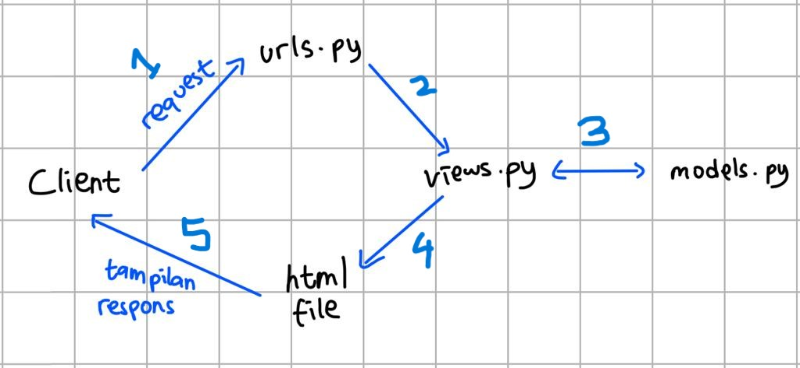
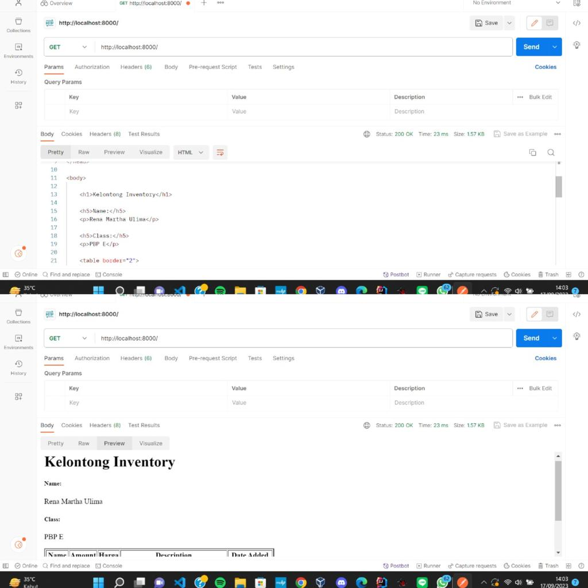
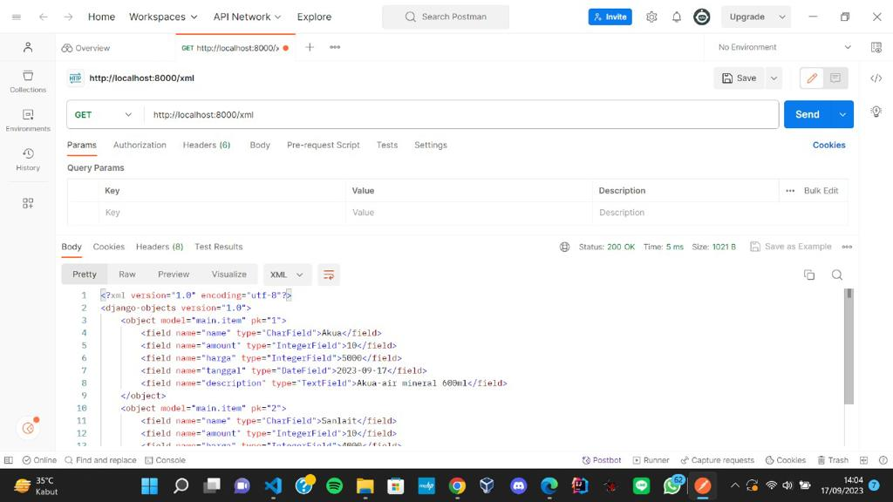
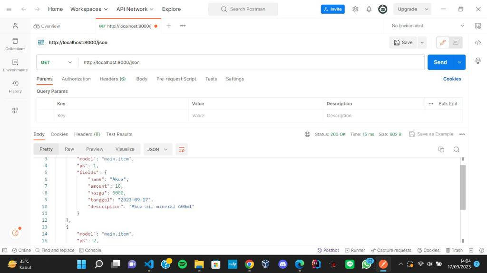
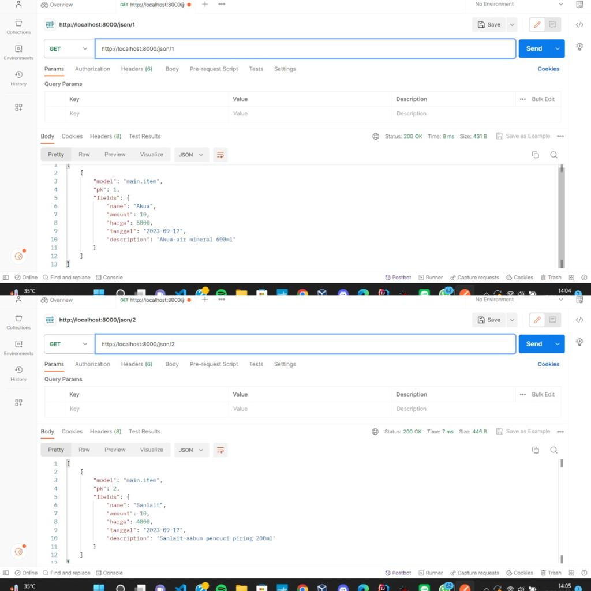
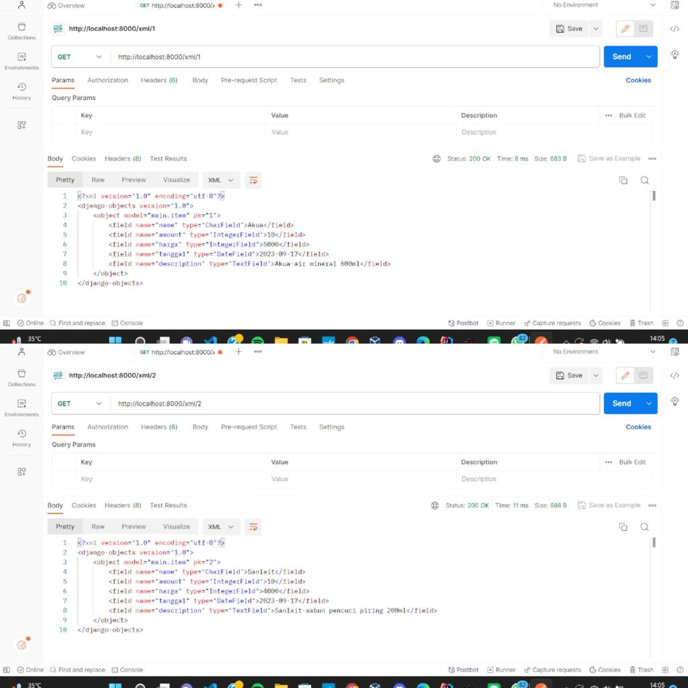

# TUGAS 2

tautan adaptable : https://kelontong.adaptable.app
tautan repositori : https://github.com/renamartha/kelontong.git

### 1. Jelaskan bagaimana cara kamu mengimplementasikan checklist di atas secara step-by-step (bukan hanya sekadar mengikuti tutorial).
Jawab:
a. Membuat proyek Django baru
- Pertama membuat direktori utama kelontong di komputer lokal.
- Masuk ke direktori tersebut menggunakan command prompt dan membuat virtual environment dengan perintah `python -m venv env`. Setelah itu, virtual environment diaktifkan dengan perintah `env\Scripts\activate.bat`.
- Pada direktori kelontong membuat berkas requirements.txt yang berisikan beberapa dependencies
```
(django
gunicorn
whitenoise
psycopg2-binary
requests
urllib3)
```
- Masih dalam kondisi virtual environment yang aktif, saya memasang dependencies yang sudah dimasukkan pada berkas requirements.txt dengan menjalankan perintah `pip install -r requirements.txt`
- Membuat proyek Django baru dengan nama kelontong, dengan menjalankan perintah `django-admin startproject kelontong .`
- Setelah proyek baru terbentuk, saya mengonfigurasikan proyek dan menjalankan server dengan menambahkan "*" pada ALLOWED_HOSTS di settings.py agar mendapat izin akses dari semua host. Lalu saya menjalankan perintah `python manage.py runserver` dan saat membuka http://localhost:8000 pada peramban web, ada animasi roket yang menandakan aplikasi Django berhasil dibuat.
- Setelah itu saya mengunggah proyek ke repositori di github (membuat repositori baru di github dengan nama kelontong serta menambahkan berkas .gitignore (seperti pada tutorial 0), lalu melakukan add, commit, push dari direktori lokal "kelontong")

b. Membuat aplikasi dengan nama main pada proyek kelontong
- Dengan kondisi berada pada direktori utama kelontong dan virtual environment yang aktif, saya menjalankan perintah `python manage.py startapp main` untuk membuat aplikasi baru dengan nama main (setelah menjalankan perintah tersebut terbentuk direktori baru bernama main).
- Setelah terbentuk direktori baru bernama main pada direktori proyek kelontong, saya mendaftarkan aplikasi main ke dalam proyek dengan menambahkan `main` pada variabel INSTALLED_APPS di berkas settings.py dalam direktori proyek kelontong. 
- Aplikasi bernama main sudah didaftarkan ke dalam proyek kelontong.
- Membuat template untuk tampilan
    * Membuat direktori baru bernama templates pada direktori aplikasi main
    * Membuat berkas baru bernama main.html pada direktori templates dan diisi dengan
    ```
    <h1>Kelontong</h1>

    <h5>Name: </h5>
    <p>{{ name }}</p>
    <h5>Class: </h5>
    <p>{{ class }}</p>
    ```
- Membuat model
    * Mengisi berkas models.py pada direktori aplikasi main dengan 
    ```
    from django.db import models

    class Item(models.Model):
        name = models.CharField(max_length=255)
        amount = models.IntegerField()
        harga = models.IntegerField()
        tanggal = models.DateField(auto_now_add=True)
        description = models.TextField()
    ```
    * Melakukan migrasi model dengan menjalankan perintah `python manage.py makemigrations` untuk migrasi model dan menjalankan perintah `python manage.py migrate` untuk migrasi ke dalam basis data lokal
    notes: setiap melakukan perubahan pada model, perlu dilakukan migrasi
- Menghubungkan view dengan template yang sudah dibuat
    * Mengisi berkas views.py yang ada pada direktori aplikasi main dengan 
    ```
    from django.shortcuts import render

    def show_main(request):
        context = {
            'name': 'Rena Martha Ulima',
            'class': 'PBP E'
        }
        return render(request, "main.html", context)"
    ```

c. Melakukan routing pada proyek agar dapat menjalankan aplikasi main
- Routing URL aplikasi main
Membuat berkas urls.py pada direktori aplikasi main dan diisi dengan 
```
from django.urls import path
from main.views import show_main

app_name = 'main'

urlpatterns = [
    path('', show_main, name='show_main'),
]
```
- Routing URL proyek
Menambahkan impor fungsi include `from django.urls import path, include` dan menambahkan rute URL dalam variabel urlpatterns `path('', include('main.urls'))` pada berkas urls.py pada direktori proyek kelontong (bukan direktori aplikasi main)

- Menjalankan proyek dengan perintah `python manage.py runserver` dan halaman web dapat dilihat

d. Membuat model pada aplikasi main dengan nama Item dan memiliki atribut wajib (name, amount, description)
(Dijelaskan pada poin b bagian membuat model)

e. Membuat sebuah fungsi pada views.py untuk dikembalikan ke dalam sebuah template HTML yang menampilkan nama aplikasi serta nama dan kelas kamu.
(Dijelaskan pada poin b bagian menghubungkan view dengan template)

f. Membuat sebuah routing pada urls.py aplikasi main untuk memetakan fungsi yang telah dibuat pada views.py
(Dijelaskan pada poin c bagian routing URL aplikasi main)

g. Membuat dan menjalankan test
- Mengisi berkas tests.py pada direktori aplikasi main dengan 
```
from django.test import TestCase, Client

class mainTest(TestCase):
    def test_main_url_is_exist(self):
        response = Client().get('/main/')
        self.assertEqual(response.status_code, 200)

    def test_main_using_main_template(self):
        response = Client().get('/main/')
        self.assertTemplateUsed(response, 'main.html')
```
menjalankan test dengan perintah `python manage.py test`, dan tes berhasil.

### 2. Buatlah bagan yang berisi request client ke web aplikasi berbasis Django beserta responnya dan jelaskan pada bagan tersebut kaitan antara urls.py, views.py, models.py, dan berkas html.
Jawab:
 atau bisa dilihat pada link berikut https://drive.google.com/file/d/1tJFIxfI85HxyIpVAfe0UJGIG91bl2ufl/view?usp=sharing 
(1) Client meminta request untuk mengakses halaman atau fitur pada web aplikasi 
(2) URL routing, urls.py akan menentukan pola URL yang akan mengarahkan request dari client ke tampilan/views yang sesuai
(3) views.py akan mengambil request yang diterima URL dan berkomunikasi dengan model (models.py) untuk mengambil atau menyimpan data yang dibutuhkan
(4) Setelah melakukan komunikasi dengan model, views akan mengembalikan respon yang sesuai dengan yang ada pada template (html file)
(5) Dikembalikan respons kepada client sesuai dengan request (dengan tampilan halaman html file yang sesuai)


### 3. Jelaskan mengapa kita menggunakan virtual environment? Apakah kita tetap dapat membuat aplikasi web berbasis Django tanpa menggunakan virtual environment?
Jawab:
Kita menggunakan virtual environment untuk mengisolasi package dan dependencies proyek aplikasi agar tidak bertabrakan dengan versi lain yang ada di komputer atau mempengaruhi proyek lain. Bisa saja membuat aplikasi web berbasis Django tanpa menggunakan virtual environment, namun mungkin akan menyebabkan kompleksitas dependencies proyek.

### 4. Jelaskan apakah itu MVC, MVT, MVVM dan perbedaan dari ketiganya.
Jawab:
MVC, MVT, MVVM merupakan model-model/konsep arsitektur yang digunakan dalam mengembangkan software/perangkat lunak khususnya dalam aplikasi berbasis web. Model-model tersebut memisahkan komponen-komponen utama dari aplikasi agar pengembang dapat mengelola dan mengorganisasikan kode dengan lebih terstruktur. 

(1) MVC (Model View Controller)
- Model berisi logika dan data yang ada dalam aplikasi. Model bertugas mendapatkan, memanipulasi data, berkomunikasi dengan controller, interaksi dengan database.
- View berkaitan dengan interface client (html, css) serta menyajikan data yang sesuai dengan request client. Komponen ini juga berinteraksi dengan model (menerima data dari model dan mengirimkan ke controller).
- Controller berperan sebagai perantara antara view dan model. Controller menerima input dari client melalui view, memproses input, lalu melakukan mengkomunikasikannya dengan model jika ada perubahan data.

(2) MVT (Model View Template)
- Model dan view pada MVT juga memiliki peran dan tanggung jawab yang sama dengan model dan view pada MVC
- Template komponen yang berfungsi mengatur tampilan client. Template digunakan untuk merancang tampilan yang akan diisi dengan data dari model melalui view. Template memisahkan html dengan logika aplikasi.

(3) MVVM (Model View ViewModel)
- Model dan view pada MVVM juga memiliki peran dan tanggung jawab yang sama dengan model dan view pada MVC dan MVT
- ViewModel merupakan komponen yang memisahkan view dari model. Komponen ini berinteraksi dengan model dimana data yang akan diteruskan ke view

Ketiga arsitektur tersebut memiliki perbedaan pada bagaimana komponen-komponen utama aplikasi dipisahkan.

Referensi:
* https://www.dicoding.com/blog/tips-design-pattern-mvvm/
* https://medium.com/@ankit.sinhal/mvc-mvp-and-mvvm-design-pattern-6e169567bbad
* Tutorial 0 dan Tutorial 1

<br>

# TUGAS 3

### 1. Apa perbedaan antara form POST dan form GET dalam Django?
Jawab:
POST digunakan saat ingin mengirim data yang perlu dikirimkan atau diperbarui di server. Dengan menggunakan POST, data yang dikirimkan tidak akan terlihat pada URL (lebih aman digunakan terutama jika mengirim data sensitif). Dalam membuat perubahan pada database juga harus menggunakan POST. Sedangkan pada GET, dilakukan penggabungan data yang kemudian dikirimkan ke sebuah string dan nantinya digunakan untuk membuat URL. Oleh karena itu, data akan terlihat pada URL, riwayat browser, dan log server (berbahaya jika digunakan untuk data sensitif). POST juga mempunyai ukuran data yang lebih besar daripada GET.

### 2. Apa perbedaan utama antara XML, JSON, dan HTML dalam konteks pengiriman data?
Jawab:
XML, JSON, dan HTML merupakan format-format data yang digunakan dalam pengembangan web dan aplikasi. XML dan JSON digunakan untuk menyimpan dan transmisi data, sedangkan HTML berfokus pada bagaimana data ditampilkan (membuat tampilan halaman). XML dan JSON mampu memindahkan data antar server dan biasanya digunakan bersama dengan HTML. Secara struktur data, XML mempunyai struktur yang mana setiap elemen data diberi tanda kurung dengan tag deskriptif, elemen ini dapat disesuaikan dengan kebutuhan pengguna (custom) sehingga XML memiliki struktur yang fleksibel. Sedangkan, JSON memiliki struktur yang ringan karena terdiri dari pasangan key-value. 

### 3. Mengapa JSON sering digunakan dalam pertukaran data antara aplikasi web modern?
Jawab:
JSON lebih sering digunakan dalam pertukaran data antara aplikasi web modern karena format/struktur yang digunakan ringan dan ringkas (memuat pasangan key-value), lebih mudah dibaca dan ditulis manusia, dan JSON lebih mudah diinterpretasikan/diuraikan dengan JavaScript.

### 4. Jelaskan bagaimana cara kamu mengimplementasikan checklist di atas secara step-by-step (bukan hanya sekadar mengikuti tutorial).
Jawab:
a. Membuat input form untuk menambahkan objek model.
(1) Pertama-tama, saya membuat skeleton sebagai kerangka views. Skeleton tersebut dibuat dengan:
* Membuat folder "templates" pada folder/direktori utama. Pada folder "templates" tersebut dibuat sebuah file HTML bernama "base.html". File ini menjadi template untuk kerangka umum halaman web proyek ini.
File HTML baru ini diisi dengan kode:
```

<!DOCTYPE html>
<html lang="en">
    <head>
        <meta charset="UTF-8" />
        <meta
            name="viewport"
            content="width=device-width, initial-scale=1.0"
        />
        
        
    </head>

    <body>
        
        
    </body>
</html>
```
* Setelah membuat file tersebut, buka settings.py pada subdirektori atau direktori proyek "kelontong" dan menambahkan kode 'DIRS': [BASE_DIR / 'templates'] pada baris yang mengandung TEMPLATES.
* Mengubah kode pada file "main.html" yang ada pada subdirektori "templates" pada direktori main dengan:
```



    <h1>Kelontong Inventory</h1>

    <h5>Name:</h5>
    <p>{{name}}</p>

    <h5>Class:</h5>
    <p>{{class}}</p>

```

(2) Membuat form input dengan cara:
* Membuat file baru bernama "forms.py" pada direktori "main". File tersebut diisi dengan kode:
```
from django.forms import ModelForm
from main.models import Item

class ProductForm(ModelForm):
    class Meta:
        model = Item
        fields = ["name", "amount", "harga", "description"]
```

* Menambahkan import pada file "views.py" pada direktori "main".
```
"from django.http import HttpResponseRedirect
from main.forms import ProductForm
from django.urls import reverse
from main.forms import Item
```

* Membuat fungsi baru bernama "create_product" dengan parameter request
```
def create_product(request):
    form = ProductForm(request.POST or None)

    if form.is_valid() and request.method == "POST":
        form.save()
        return HttpResponseRedirect(reverse('main:show_main'))

    context = {'form': form}
    return render(request, "create_product.html", context)
```
* Mengubah fungsi "show_main" pada file "views.py" menjadi:
"def show_main(request):
    ```
   products = Item.objects.all()

   context = {
      	'name': 'Rena Martha Ulima',
      	'class': 'PBP E',
      	'products': products
	'total_products': products.__len__()
   }
   
   return render(request, "main.html", context)"
   ```

* Import fungsi "create_product" pada file "urls.py" di direktori main
```
from main.views import show_main, create_product"
```

* Menambahkan path url ke "urlpatterns" yang ada pada file "urls.py" di direktori main untuk mengakses fungsi yang diimport
path('create-product', create_product, name='create_product')

* Membuat berkas HTML bernama "create_product.html" pada subdirektori templates di direktori main dan diisi dengan:
```
 


<h1>Add New Item</h1>

<form method="POST">
    
    <table>
        {{ form.as_table }}
        <tr>
            <td></td>
            <td>
                <input type="submit" value="Add Item"/>
            </td>
        </tr>
    </table>
</form>

"
```
Ini untuk halaman form ketika akan menambahkan Item

* Menambahkan kode berikut di dalam  pada file "main.html"
```
<table border="2"> # Menambahkan garis/border table
          <tr>
               <th>Name</th>
               <th>Amount</th>
               <th>Harga</th>
               <th>Description</th>
               <th>Date Added</th>
          </tr>
          
           Cara memperlihatkan data produk 
          
          <h5> Telah disimpan sebanyak {{total_products}} item <h5> #Menambahkan baris yang menunjukkan total
								     produk yang ditambahkan  
          
               <tr>
                    <td>{{product.name}}</td>
                    <td>{{product.amount}}</td>
                    <td>{{product.harga}}</td>
                    <td>{{product.description}}</td>
                    <td>{{product.tanggal}}</td>
               </tr>
          
     </table>
          
     <br />
          
          <a href="">
          <button>
               Add New Item
          </button>
     </a>"
```
Penambahan kode ini ditujukan untuk menampilkan data item yang sudah ditambahkan dalam bentuk table dan membuat tombol "Add New Item" yang redirect ke halaman form.

b. Menambahkan 5 fungsi views untuk melihat objek yang sudah ditambahkan dalam format HTML, XML, JSON, XML by ID, dan JSON by ID dan melakukan routing URL untuk masing-masing views
(1) Dalam format HTML (sudah dijelaskan pada bagian ke-2 "Membuat from input")

(2) Dalam format XML 
* Pertama-tama, saya menambahkan import di file "views.py" yang ada pada direktori main
```
from django.http import HttpResponse
from django.core import serializers"
```

* Pada file tersebut, membuat sebuah fungsi baru "show_xml" dengan parameter request
```
def show_xml(request):
    data = Item.objects.all()
    return HttpResponse(serializers.serialize("xml", data), content_type="application/xml")
```
* Menambahkan import fungsi "show_xml" di file "urls.py" pada direktori main
```
from main.views import show_main, create_product, show_xml 
```

* Menambahkan path urls dalam "urlspatterns"
```
path('xml/', show_xml, name='show_xml')
```

(3) Dalam format JSON (langkah yang dilakukan sama seperti format XML)
* Membuat fungsi "show_json" dengan parameter request pada file "views.py" di direktori main
```
def show_json(request):
    data = Item.objects.all()
    return HttpResponse(serializers.serialize("json", data), content_type="application/json")
```

* Menambahkan import fungsi "show_json" di file "urls.py" pada direktori main
```
from main.views import show_main, create_product, show_xml, show_json
```

* Menambahkan path urls dalam "urlspatterns"
```
path('json/', show_json, name='show_json')
```

(4) Dalam format XML by ID
* Membuat fungsi "show_xml_by_id" pada dengan parameter request dan id pada file "views.py" di direktori main
```
def show_xml_by_id(request, id):
    data = Item.objects.filter(pk=id)
    return HttpResponse(serializers.serialize("xml", data), content_type="application/xml")
```
* Menambahkan import fungsi "show_xml_by_id" di file "urls.py" pada direktori main
```
from main.views import show_main, create_product, show_xml, show_json, show_xml_by_id
```

* Menambahkan path urls dalam "urlspatterns"
```
path('xml/<int:id>/', show_xml_by_id, name='show_xml_by_id')
```

(5) Dalam format JSON by ID (langkah sama seperti XML by ID)
* Membuat fungsi "show_json_by_id" pada dengan parameter request dan id pada file "views.py" di direktori main
```
def show_json_by_id(request, id):
    data = Item.objects.filter(pk=id)
    return HttpResponse(serializers.serialize("json", data), content_type="application/json")
```

* Menambahkan import fungsi "show_json_by_id" di file "urls.py" pada direktori main 
```
from main.views import show_main, create_product, show_xml, show_json, show_xml_by_id, show_json_by_id 
```
* Menambahkan path urls dalam "urlspatterns"
```
path('json/<int:id>/', show_json_by_id, name='show_json_by_id')"
```


Screenshoot hasil akses URL pada Postman
* HTML 

* XML

* JSON

* JSON BY ID

* XML BY ID


Referensi:
 https://docs.djangoproject.com/id/4.2/topics/forms/
* https://www.geeksforgeeks.org/render-html-forms-get-post-in-django/
* https://www.w3schools.com/js/js_json_xml.asp
* https://www.deltaxml.com/blog/xml/whats-the-relationship-between-xml-json-html-and-the-internet:~:text=The%20differences%20between%20XML%2C%20JSON,how%20that%20data%20is%20displayed
* Tutorial 3

# TUGAS 4

## 1. Apa itu Django UserCreationForm, dan jelaskan apa kelebihan dan kekurangannya?
Jawab:
Django UserCreationForm merupakan form bawaan dari Django yang membantu dan memudahkan dalam pembuatan formulir registrasi user dalam aplikasi web. Form ini digunakan untuk membuat objek user baru dalam basis data. Kelebihannya yaitu user dapat melakukan registrasi/pendaftaran dengan mudah di situs web tanpa pengembang web harus membuat kode dari awal serta memeriksa input dari user (apakah input seperti username dan password sudah sesuai dengan kriteria yang diberikan). Kekurangannya yaitu tampilan halaman registrasi perlu dirancang/didesain sendiri oleh pengembang (UserCreationForm hanya menyediakan pemrosesan saja)

## 2. Apa perbedaan antara autentikasi dan otorisasi dalam konteks Django, dan mengapa keduanya penting?
Jawab:
Autentikasi merupakan sebuah proses yang mengidentifikasi dan memverifikasi identitas seseorang saat login (siapa dan apakah seseorang tersebut terdaftar). Sedangkan, otorisasi merupakan proses yang memverifikasi bahwa seseorang memiliki akses terhadap sesuatu dalam aplikasi perangkat lunak (terdapat pengaturan dan penentuan hak akses pengguna). Autentikasi dan otorisasi merupakan dua hal yang penting karena dengan adanya dua proses tersebut akan membantu melindungi aplikasi perangkat lunak dari seseorang yang mencoba melakukan tindakan yang tidak diizinkan (faktor keamanan) serta dapat mengatur akses tiap pengguna sehingga seseorang yang mungkin tidak memiliki izin untuk mengakses suatu bagian/data/fitur pada aplikasi, maka mereka tidak bisa mengaksesnya.

## 3. Apa itu cookies dalam konteks aplikasi web, dan bagaimana Django menggunakan cookies untuk mengelola data sesi pengguna?
Jawab:
Cookies merupakan kumpulan informasi mengenai jejak kunjungan pengguna dan aktivitas pengguna dalam menelusuri website / kumpulan informasi yang diterima dari sebuah website dan disimpan pada sisi klien (biasanya browser)  dan mengirimkan kembali ke website yang dikunjungi. Pada saat membuat proyek Django, di berkas "settings.py" pada direktori proyek terdapat variabel yaitu "MIDDLEWARE" yang berisikan 'django.contrib.sessions.middleware.SessionMiddleware'. Middleware ini akan menangani session cookies. 

## 4. Apakah penggunaan cookies aman secara default dalam pengembangan web, atau apakah ada risiko potensial yang harus diwaspadai?
Jawab:
Penggunaan cookies secara default aman karena cookie ini bersifat sementara. Informasi akan disimpan dalam memori browser dan ketika browser ditutup, maka informasi cookie tersebut akan terhapus (sehingga tidak dapat digunakan untuk melacak informasi dalam jangka panjang). Cookies ini juga lebih aman karena hanya browser yang bisa mengakses.

## 5. Jelaskan bagaimana cara kamu mengimplementasikan checklist di atas secara step-by-step
Jawab:
* Mengimplementasikan fungsi registrasi
- Menambahkan import redirect, UserCreationForm, dan messages pada berkas views.py di direktori aplikasi.
- Membuat fungsi bernama register dengan parameter request. Pada fungsi tersebut memanggil UserCreationForm() untuk membentuk formulir registrasi bawaan Django
- Membuat berkas HTML bernama register.html pada subdirektori templates yang ada di direktori aplikasi. Ini adalah template untuk tampilan halaman saat melakukan registrasi.
- Menambahkan import register pada berkas urls.py yang ada di direktori aplikasi. Setelah itu, menambahkan path url ke urlpatterns untuk bisa mengakses fungsi register yang sudah dibuat.

* Mengimplementasikan fungsi login
- Membuat fungsi bernama login_user dengan parameter request pada berkas views.py yang ada di direktori aplikasi
-  Menambahkan import authenticate dan login pada berkas views.py
- Berikut adalah isi dari fungsi login_user
```
def login_user(request):
    if request.method == 'POST':
        username = request.POST.get('username')
        password = request.POST.get('password')
        user = authenticate(request, username=username, password=password)
        if user is not None:
            login(request, user)
            return redirect('main:show_main')
        else:
            messages.info(request, 'Sorry, incorrect username or password. Please try again.')
    context = {}
    return render(request, 'login.html', context)
```
- Membuat berkas bernama login.html pada subdirektori templates yang ada di direktori aplikasi. Ini adalah template untuk tampilan halaman saat melakukan login
- Menambahkan import login_user pada berkas urls.py yang ada di direktori aplikasi. Setelah itu, menambahkan path url ke urlpatterns untuk bisa mengakses fungsi login_user yang sudah dibuat

* Mengimplementasikan fungsi logout
- Membuat fungsi bernama logout_user dengan parameter request pada berkas views.py yang ada di direktori aplikasi
-  Menambahkan import logout pada berkas views.py
- Berikut adalah isi dari fungsi logout_user
```
def logout_user(request):
    logout(request)
    return redirect('main:login')
```
- Menambahkan kode berikut setelah button Add New Product
```
<a href="">
    <button>
        Logout
    </button>
</a>
```
- Menambahkan import logout_user pada berkas urls.py yang ada di direktori aplikasi. Setelah itu, menambahkan path url ke urlpatterns untuk bisa mengakses fungsi logout_user yang sudah dibuat

* Restriksi akses halaman main
- Menambahkan import login_required pada berkas views.py yang ada di direktori aplikasi
- Menambahkan kode "@login_required(login_url='/login')" diatas fungsi show_main (agar main dapat diakses jika pengguna sudah login/terautentikasi)

* Menghubungkan model Item dengan User
- Menambahkan import "from django.contrib.auth.models import User" pada berkas models.py yang ada di direktori aplikasi
- Menambahkan kode berikut pada model Item
```
class Item(models.Model):
    user = models.ForeignKey(User, on_delete=models.CASCADE)
```
- Mengubah kode pada fungsi create_product pada berkas views.py di direktori aplikasi menjadi:
```
def create_product(request):
form = ProductForm(request.POST or None)
if form.is_valid() and request.method == "POST":
    product = form.save(commit=False)
    product.user = request.user
    product.save()
    return HttpResponseRedirect(reverse('main:show_main'))
```
- Mengubah fungsi show_main menjadi
```
def show_main(request):
    products = Product.objects.filter(user=request.user)

    context = {
        'name': request.user.username,
        ...
```
- Melakukan migrasi model (makemigrations lalu migrate)

* Membuat dua akun pengguna dengan masing-masing tiga dummy data
- Akun 1
Register dengan username "rena" dan password "050204rena"
Pada akun ini terdapat 3 data sesuai dengan model yang telah dibuat
- Akun 2
Register dengan username "test" dan password "testest123"
Pada akun ini terdapat 3 data sesuai dengan model yang telah dibuat

* Menampilkan detail informasi pengguna yang sedang logged in seperti username dan menerapkan cookies seperti last login pada halaman utama
- Menambahkan 'username = request.user.username' pada context di fungsi show_main di berkas views.py pada direktori aplikasi (menampilkan detil pengguna yang sedang logged in)
- Menambahkan import datetime di berkas views.py pada direktori aplikasi. 
- Menambahkan fungsi untuk menambah cookie bernama last_login pada fungsi login_user. Potongan kode pada fungsi login_user diubah menjadi
```
... 
if user is not None:
    login(request, user)
    response = HttpResponseRedirect(reverse("main:show_main")) 
    response.set_cookie('last_login', str(datetime.datetime.now()))
    return response 
    ...
```
- Menambahkan kode 
```
'last_login': request.COOKIES['last_login']
``` 
ke variabel context di fungsi show_main pada berkas views.py
- Mengubah fungsi logout_user pada berkas views.py menjadi
```
def logout_user(request):
    logout(request)
    response = HttpResponseRedirect(reverse('main:login'))
    response.delete_cookie('last_login')
    return response
```
- Menambahkan kode berikut pada berkas main.html
```
<h5>Sesi terakhir login: {{ last_login }}</h5>
```

* Membuat tombol dan fungsi untuk menambahkan dan mengurangi amount suatu item sebanyak satu
- Membuat fungsi bernama tambah_jumlah_item dan kurangi_jumlah_item dengan parameter request dan id_item pada berkas views.py yang ada di direktori aplikasi
- Berikut adalah isi dari fungsi tambah_jumlah_item
```
def tambah_jumlah_item(request, id_item):
    product = get_object_or_404(Item, pk=id_item, user=request.user)
    product.amount += 1
    product.save()
    return HttpResponseRedirect(reverse('main:show_main')) 
```
- Berikut adalah isi dari fungsi kurangi_jumlah_item
```
def kurangi_jumlah_item(request, id_item):
    product = get_object_or_404(Item, pk=id_item, user=request.user)
    if product.amount > 0:
        product.amount -= 1
        product.save()
    else:
        messages.warning(request, 'Jumlah item sudah 0, tidak bisa melakukan pengurangan!')
    return HttpResponseRedirect(reverse('main:show_main'))
```
get_object_or_404 merupakan fungsi bawaan Django yang digunakan untuk mencari objek berdasarkan model tertentu, jika tidak ditemukan maka menampilkan halaman 404.
- Menambahkan kode berikut pada main.html di for loop product in products
```
<td>
    <a href=""> 
        <button>-</button> 
    </a>
    <span>{{ product.amount }}</span>
    <a href="">
        <button>+</button> 
    </a>
</td>
```
- Menambahkan import tambah_jumlah_item dan kurangi_jumlah_item pada berkas urls.py yang ada di direktori aplikasi. Setelah itu, menambahkan path url ke urlpatterns untuk bisa mengakses fungsi tambah_jumlah_item dan kurangi_jumlah_item yang sudah dibuat.

* Membuat tombol dan fungsi untuk menghapus suatu objek
- Membuat fungsi bernama hapus_item dengan parameter request dan id_item pada berkas views.py yang ada di direktori aplikasi
- Berikut adalah isi dari fungsi hapus_item
```
def hapus_item(request, id_item):
    product = get_object_or_404(Item, pk=id_item, user=request.user)
    product.delete()
    return HttpResponseRedirect(reverse('main:show_main'))
```
get_object_or_404 merupakan fungsi bawaan Django yang digunakan untuk mencari objek berdasarkan model tertentu, jika tidak ditemukan maka menampilkan halaman 404.
- Menambahkan kode berikut pada main.html di for loop product in products
```
<td>
    <a href="">
        <button>
            Hapus Item 
        </button>
    </a>
</td>
```
- Menambahkan import hapus_item pada berkas urls.py yang ada di direktori aplikasi. Setelah itu, menambahkan path url ke urlpatterns untuk bisa mengakses fungsi hapus_item yang sudah dibuat.

<br>

# TUGAS 5

### 1.  Jelaskan manfaat dari setiap element selector dan kapan waktu yang tepat untuk menggunakannya.
Jawab:
Dengan selector, kita dapat menerapkan styling ke  tiap elemen dengan jenis tag HTML yang sama.
* Selector elemen/tag
- Manfaatnya digunakan untuk memilih semua elemen yang memiliki jenis tag yang sama.
- Waktu yang tepat untuk menggunakan selector ini yaitu ketika ingin menerapkan style yang sama ke semua elemen dengan tag yang sama. Misal, ingin menerapkan style seperti mengubah text font ke semua tag `<p>`

* Selector class
- Manfaatnya yaitu digunakan untuk memilih elemen berdasarkan atribut class yang sama.
- Waktu yang tepat untuk menggunakan selector ini yaitu ketika ingin menerapkan style hanya ke beberapa elemen dengan class yang sama. Misal, ingin menerapkan style pada setiap class="button". Format dari class selector yaitu `.[class_name]`

* Selector ID
- Manfaatnya yaitu digunakan untuk memilih elemen berdasarkan atribut id yang sama.
- Waktu yang tepat untuk menggunakan selector ini yaitu ketika ingin menerapkan style ke elemen dengan id tertentu.
Misal ingin menerapkan style pada id="header". Format dari id selector yaitu `#[id_name]`

* Selector Universal
- Manfaatnya yaitu digunakan untuk memilih semua elemen dalam berkas HTML
- Waktu yang tepat untuk menggunakan selector ini yaitu ketika ingin menerapkan style yang sama ke semua elemen.

### 2. Jelaskan HTML5 Tag yang kamu ketahui.
Jawab:
* `<title>` untuk menentukan judul halaman yang akan ditampilkan
* `<style>` untuk menentukan style pada halaman web seperti background color, text font, dll
* `<body>` sebagai wadah untuk konten utama pada halaman
* `<p>` untuk menampilkan teks paragraf
* `<h1>`, `<h2>`, ... , `<h6>` untuk menentukan judul/heading dengan tingkatan. `<h1>` menjadi judul utama/paling tinggi dalam tingkatan judul.
* `<div>`untuk mengelompokkan berbagai elemen pada sebuah kontainer
* `<span>` untuk mengelompokkan sebagian kecil dari teks/elemen untuk styling

 ## 3. Jelaskan perbedaan antara margin dan padding.
 Jawab:
 * Margin merupakan ruang diluar elemen dan dapat digunakan untuk mengontrol jarak antara elemen. Sedangkan, padding merupakan ruang didalam elemen dan mengontrol jarak antara konten dan batas elemen

 ## 4. Jelaskan perbedaan antara framework CSS Tailwind dan Bootstrap. Kapan sebaiknya kita menggunakan Bootstrap daripada Tailwind, dan sebaliknya?
 Jawab:
 Tailwind tidak memiliki desain bawaan sehingga lebih fleksibel dalam custom style, sedangkan bootstrap memiliki desain bawaan sehingga lebih cepat dan mudah dalam membuat tampilan. Selain itu, ukuran file dengan tailwind lebih kecil dibanding bootstrap.

 ## 5. Jelaskan bagaimana cara kamu mengimplementasikan checklist di atas secara step-by-step (bukan hanya sekadar mengikuti tutorial).
 Jawab:
 * Pertama saya menambahkan bootstrap ke dalam project yaitu dengan menambahkan 
 ```
 <head>
    
        ...
    
    <link href="https://cdn.jsdelivr.net/npm/bootstrap@5.3.2/dist/css/bootstrap.min.css" rel="stylesheet" integrity="sha384-T3c6CoIi6uLrA9TneNEoa7RxnatzjcDSCmG1MXxSR1GAsXEV/Dwwykc2MPK8M2HN" crossorigin="anonymous">
    <script src="https://code.jquery.com/jquery-3.6.0.min.js" integrity="sha384-KyZXEAg3QhqLMpG8r+J4jsl5c9zdLKaUk5Ae5f5b1bw6AUn5f5v8FZJoMxm6f5cH1" crossorigin="anonymous"></script>
    <script src="https://cdn.jsdelivr.net/npm/@popperjs/core@2.11.8/dist/umd/popper.min.js" integrity="sha384-I7E8VVD/ismYTF4hNIPjVp/Zjvgyol6VFvRkX/vR+Vc4jQkC+hVqc2pM8ODewa9r" crossorigin="anonymous"></script>
    <script src="https://cdn.jsdelivr.net/npm/bootstrap@5.3.2/dist/js/bootstrap.min.js" integrity="sha384-BBtl+eGJRgqQAUMxJ7pMwbEyER4l1g+O15P+16Ep7Q9Q+zqX6gSbd85u4mG4QzX+" crossorigin="anonymous"></script>

</head>
```
* Setelah itu saya membuat button untuk mengedit item dengan tahap:
- Membuat berkas HTML dengan nama "edit_product.html" pada subdirektori templates. Berkas tersebut berisikan:
```






<style> 
     body {
         background-color:beige;
         font-family: "Times New Roman", Times, serif;
     }
</style>

<h1><b>Edit Product</h1>

<form method="POST">
     
     <table>
          {{ form.as_table }}
          <tr>
               <td></td>
               <td>
                    <input type="submit" value="Edit Product"/>
               </td>
          </tr>
     </table>
</form>


```
- Mengimport fungsi edit_product pada urls.py di direktori main dan menambahkan path url ke urlpatterns 

- Menambahkan kode untuk button pada main.html (button edit item saya buat satu kolom dengan hapus item)
```
 <td>
    <a href="">
        <button class="btn btn-info">
            Edit Item
        </button>
    </a>
....
```

* Setelah itu saya melakukan kustomisasi login page
```



     <title>Login</title>




<style> 
     body {
          display: flex;
          justify-content: center;
          align-items: center;
          height: 100vh;
          background-color:beige;
          font-family: "Times New Roman", Times, serif;
     }
     .login {
          text-align: center;
          font-family: "Times New Roman", Times, serif;
     }
</style>

<div class = "login">

     <h1>Login</h1>

     <form method="POST" action="" >
          
          <table>
               <tr>
                    <td>Username: </td>
                    <td><br><input type="text" name="username" placeholder="Username" class="form-control"></br></td> 
               </tr>
                    
               <tr>
                    <td>Password: </td>
                    <td><input type="password" name="password" placeholder="Password" class="form-control"></td> 
               </tr>

               <tr>
                    <td></td>
                    <td><br><button type="submit" class="btn btn-primary">Login</button></td></td>
               </tr>
          </table>
     </form>

     
          <ul>
               
                    <li>{{ message }}</li>
               
          </ul>
          
          
     Don't have an account yet? <a href="">Register Now</a>

</div>


```

* Melakukan kustomisasi pada main page
```



<style> 
     body {
          background-color:beige;
     }

     #table_item tr:last-child td{
          background-color: rgb(171, 169, 169);
     }
</style>

     <h1 class="text-center" style="font-family:Times New Roman, Times, serif"><b>Kelontong Inventory</b></h1>
     <p class="text-center" style="font-family:Times New Roman, Times, serif">by {{nama}} - {{class}}</p>

     <p style="font-family:Times New Roman, Times, serif">User login: <b>{{username}}</b></p> 

     <table class="table table-bordered text-center" id="table_item">
          <tr style="font-family:Times New Roman, Times, serif;  background-color:beige;">
               <th scope="col">Name</th>
               <th scope="col">Amount</th>
               <th scope="col">Harga</th>
               <th scope="col">Description</th>
               <th scope="col">Date Added</th>
               <th scope="col"></th>
          </tr>
          
           Cara memperlihatkan data produk 
          
          <p style="font-family:Times New Roman, Times, serif"> Telah disimpan sebanyak <b>{{total_products}}</b> item </p>
          
               <tr style="font-family:Times New Roman, Times, serif">
                    <td scope="row">{{product.name}}</td>
                    <td>
                         <div class="amount-container">
                              <a href="">
                                   <button type="button" class="btn btn-outline-warning">-</button>
                              </a>
                              <span>{{ product.amount }}</span>
                              <a href="">
                                  <button type="button" class="btn btn-outline-success">+</button>
                              </a>
                          </div>
                    </td>
                    <td>{{product.harga}}</td>
                    <td>{{product.description}}</td>
                    <td>{{product.tanggal}}</td>
                    <td>
                         <a href="">
                              <button class="btn btn-info">
                                   Edit Item
                              </button>
                         </a>
                         <a href="">
                              <button class="btn btn-danger">
                                   Hapus Item
                              </button>
                         </a>
                    </td>
               </tr>
          
     </table>

       
     <ul>   
            
               <li>{{ message }}</li>  
                 
     </ul>   
     
          
     <a href="">
          <button class="btn btn-success"> <b>
               Add New Item
          </button>
     </a>

     <a href="">
          <button class="btn btn-danger">
              Logout
          </b></button>
     </a>

     <p style="font-family:Times New Roman, Times, serif"><br>Sesi terakhir login Kelontong Inventory : <b>{{ last_login }}</b></p>

```

* Melakukan kustomisasi register page
```



<title>Register</title>


  

<style> 
     body {
          display: flex;
          justify-content: center;
          align-items: center;
          height: 100vh;
          background-color:beige;
          font-family: "Times New Roman", Times, serif;
     }
     .login {
          font-family: "Times New Roman", Times, serif;
     }
</style>

<div class = "login">

<h1 class="text-center">Register</h1>  
<br>
     <form method="POST" >  
            
          <table>  
               {{ form.as_table }}  
               <tr>  
               <td></td>
               <td><br><input type="submit" name="submit" value="Daftar" class="btn btn-primary"/></td>  
               </tr>  
          </table>  
     </form>

  
     <ul>   
            
               <li>{{ message }}</li>  
                 
     </ul>   


</div>  


```

* Melakukan kustomisasi create item page
```
 



<style> 
    body {
        background-color:beige;
        font-family: "Times New Roman", Times, serif;
    }
</style>

<h1><b>Add New Item</h1>

<form method="POST">
    
    <table>
        {{ form.as_table }}
        <tr>
            <td></td>
            <td>
                <input type="submit" value="Add Item"/>
            </td>
        </tr>
    </table>
</form>


```

<br>

# TUGAS 6

### 1. Jelaskan perbedaan antara asynchronous programming dengan synchronous programming.
Pada asynchronous programming, beberapa proses bisa berjalan secara bersamaan tanpa menunggu proses lain selesai. Sedangkan, pada synchronous programming, program berjalan berdasarkan antrian eksekusinya (satu persatu proses dijalankan). Sehingga waktu eksekusi yang dibutuhkan pada asynchronous programming lebih singkat daripada synchronous programming. Pada asynchronous programming dapat mengirim beberapa request sekaligus (non blocking), sedangkan pada synchronous hanya mengirim satu request dan menunggu proses sebelum mengirim request lain.

### 2. Dalam penerapan JavaScript dan AJAX, terdapat penerapan paradigma event-driven programming. Jelaskan maksud dari paradigma tersebut dan sebutkan salah satu contoh penerapannya pada tugas ini.
Event-driven programming mengatur jalannya program/proses berdasarkan peristiwa yang sedang terjadi, merespons tindakan pengguna/user dengan menjalankan fungsi tertentu/event handler, seperti klik tombol. Program terdiri dari fungsi yang dikenal event handler. Ketika suatu event terjadi (seperti terjadi klik tombol), maka event handler akan dipanggil. Pada JavaScript dan AJAX, event-driven programming ini digunakan agar web menjadi responsif dan interaktif. Contoh penerapannya pada tugas 6 yaitu kode berikut:
"document.getElementById("button_add").onclick = addProduct" (pada function addProduct di berkas main.html).
addProduct dipanggil ketika terjadi event onclick (pengguna mengklik tombol)

### 3. Jelaskan penerapan asynchronous programming pada AJAX.
Penerapan AJAX memungkinkan terjadinya asynchronous programming antara browser dan server tanpa harus memuat ulang/refresh halaman web. Hal ini berarti AJAX dapat memproses tiap request yang diberikan ke server. 

### 4. Pada PBP kali ini, penerapan AJAX dilakukan dengan menggunakan Fetch API daripada library jQuery. Bandingkanlah kedua teknologi tersebut dan tuliskan pendapat kamu teknologi manakah yang lebih baik untuk digunakan.


### 5. Jelaskan bagaimana cara kamu mengimplementasikan checklist di atas secara step-by-step (bukan hanya sekadar mengikuti tutorial).

